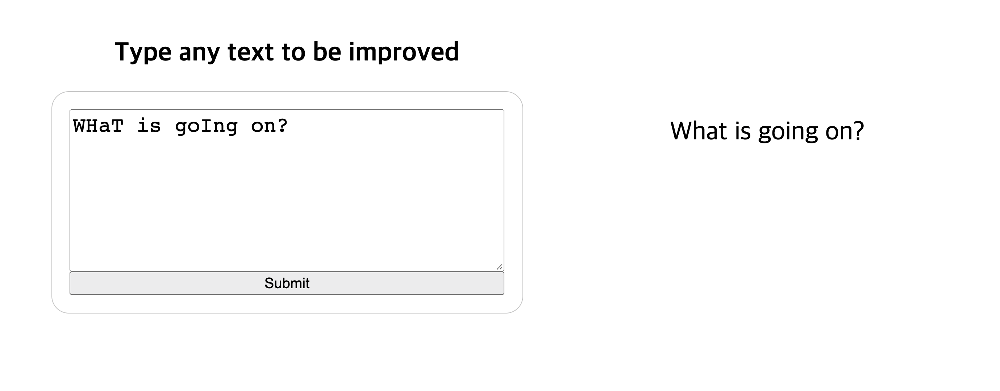
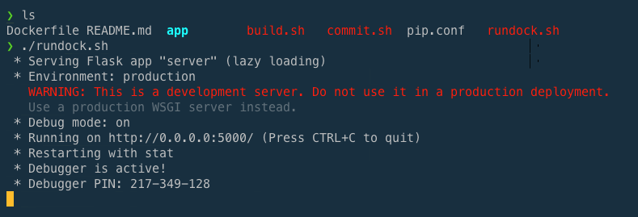

# Lang Tool Flask
  
"Language Tool" 이라는 오픈 소스 파이썬 라이브러리를 이용한 문법 교정 툴입니다.  
Language Tool에 대한 자세한 내용은 다음 사이트에서 참고 바랍니다. 
- Language tool: https://languagetool.org/?l=en&utm_source=google&utm_medium=cpc&utm_campaign=spell_checker&utm_term=grammar%20check&gclid=CjwKCAiA57D_BRAZEiwAZcfCxVFriLSMPLx-NBuZ72P-Rgt2Tr-qHzNwekN1VW0BBbouQHJ4aaJZKxoCfkoQAvD_BwE

---
## Prerequisite
해당 저장소에서는 Docker라는 툴을 통해 구동이 가능합니다. 구동중인 운영체제에 맞는 도커 버전을 설치하시면 되겠습니다.
- Docker Desktop(Windows, Mac): https://www.docker.com/products/docker-desktop
- Docker Engine(Linux): https://hub.docker.com/search?q=&type=edition&offering=community&operating_system=linux

---
## How to start?

1. build.sh 을 이용하여 Dockerfile 에 정의된 도커 이미지를 빌드합니다.  
   
   ```sh
   chmod 700 build.sh
   ./build.sh 
   ```
2. rundock.sh 을 이용하여 빌드된 도커 이미지를 실행합니다.
   ```sh
   chmod 700 rundock.sh
   ./rundock.sh
   ```

3. 아래 이미지와 같이 실행이 잘되었다면, http://localhost:5000 으로 접속하시면 됩니다.  
   
